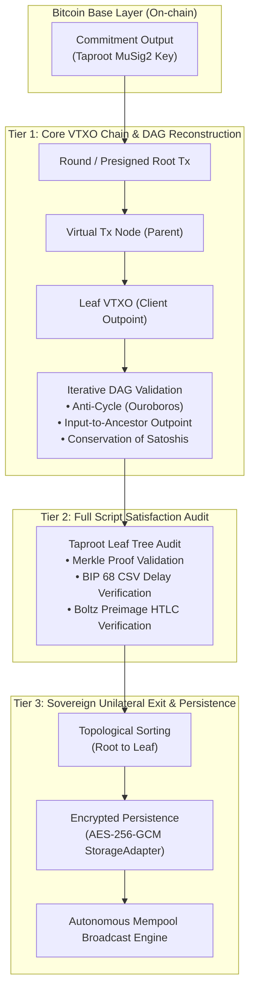

# Arkade SDK: Client-Side VTXO & Sovereign Exit Verification Pipeline

[](file:///home/chelo/antigravity/ARK/src/__tests__)
[](https://nodejs.org)
[](https://pnpm.io)
[](file:///home/chelo/antigravity/ARK/Dockerfile)
[](file:///home/chelo/antigravity/ARK/docs/SECURITY_AUDIT.md)
[](https://github.com/arkade-os/ts-sdk)

> **Zero-Trust Client Verification and Sovereign Unilateral Exit Engine for the Arkade Protocol.**

---

## 📖 Table of Contents
- [Executive Overview](#-executive-overview)
- [Architecture & Verification Tiers](#-architecture--verification-tiers)
- [Threat Model & Attack Mitigations](#-threat-model--attack-mitigations)
- [Quick Start](#-quick-start)
  - [Local Development (pnpm)](#local-development-pnpm)
  - [Containerized Sandbox (Docker / Podman)](#containerized-sandbox-docker--podman)
- [API Reference](#-api-reference)
- [Upstream Integration Blueprint](#-upstream-integration-blueprint)
- [Technical Documentation Index](#-technical-documentation-index)

---

## 🌟 Executive Overview

In the Ark protocol, the **Ark Service Provider (ASP)** acts as an untrusted coordinator for off-chain Virtual UTXOs (VTXOs). The **Arkade Verification Pipeline** guarantees complete mathematical and financial self-sovereignty for users:

1. **Zero-Trust Verification**: Every VTXO received is audited from the leaf back to the confirmed Bitcoin on-chain commitment output.
2. **Sovereign Unilateral Exit**: Prepares, validates, and locally encrypts the full topological transaction broadcast sequence. If the ASP disappears, goes rogue, or attempts censorship, the user can independently broadcast the exit sequence on Bitcoin L1 without trusting or contacting any third party.
3. **DoS & Attack Immunity**: Hardened against deep recursion stack overflows (500–1,000 depth DAGs), Ouroboros cycle loops, and synthetic orphan injections.

---

## 🏗 Architecture & Verification Tiers



### 🔹 [Tier 1] Core VTXO Chain Verification
- **Iterative DAG Reconstruction**: Non-recursive traversal reconstructing the virtual transaction DAG from the leaf back to the root on-chain anchor.
- **BIP 340 & BIP 341 Cryptography**: Full Schnorr signature verification against MuSig2 aggregated and script-tweaked Taproot public keys.
- **On-chain Anchoring**: Depth, block height, and confirmation status validated directly against Bitcoin RPC / Indexers.

### 🔹 [Tier 2] Full Script Satisfaction Verification
- **Taproot Leaf Merkle Audit**: Mathematical proof verification for all script branches in the Taproot tree.
- **BIP 68 CSV Timelock Enforcement**: Verifies relative locktimes (`CHECKSEQUENCEVERIFY`) ensuring the user exit delay strictly precedes the ASP sweep delay ($\Delta_{\text{CSV}} < \Delta_{\text{sweep}}$).
- **Submarine Swap Preimage Enforcement**: Validates SHA256 and HASH160 preimage lock leaves for Boltz atomic swaps.

### 🔹 [Tier 3] Sovereign Unilateral Exit
- **Topological Sorting**: Sequences the presigned virtual transactions from root to leaf to guarantee valid broadcast order.
- **Encrypted Local Persistence**: Protects unilateral exit transaction bundles using **AES-256-GCM** via the `StorageAdapter` interface.
- **ASP-Independent Broadcast**: Capable of transmitting raw transactions directly to Bitcoin nodes / public mempools.

---

## 🛡 Threat Model & Attack Mitigations

| Threat Vector | Attack Scenario | Pipeline Defense & Mitigation | Error Code |
| :--- | :--- | :--- | :--- |
| **Ouroboros Cycle Attack** | Malicious ASP sends a circular virtual graph ($A \to B \to A$) to trigger infinite loops. | Set-based iterative visited tracking. | `CYCLE_DETECTED` |
| **Economic Inflation** | ASP issues presigned transactions where output satoshis exceed input satoshis. | Satoshi conservation verification at each node: $\sum V_{\text{out}} \le \sum V_{\text{in}}$. | `AMOUNT_MISMATCH` |
| **Orphan Payload (Mirage)** | Synthetic VTXO subgraphs disconnected from any on-chain anchor. | Rejection of graphs lacking a verified path to a confirmed commitment output. | `INPUT_CHAIN_BREAK` |
| **Premature ASP Sweep** | ASP configures an exit delay equal to or greater than its sweep delay. | Automated AST audit verifying $\Delta_{\text{CSV}} < \Delta_{\text{sweep}}$ with safety threshold. | `INVALID_TIMELOCK_SEQUENCE` |
| **Cosigner Key Poisoning** | ASP injects invalid public keys into MuSig2 aggregation. | Verification of aggregate key matching the spent output's `scriptPubKey`. | `INVALID_TAPROOT_SCRIPT` |
| **Storage Tampering** | Local device malware attempts to alter stored exit transactions. | Authenticated AES-256-GCM encryption with SHA-256 checksum integrity. | `STORAGE_DECRYPTION_FAILED` |

---

## 🚀 Quick Start

### Local Development (pnpm)

```bash
# 1. Install dependencies
pnpm install

# 2. Run full test suite (104 tests)
pnpm test

# 3. Run adversarial black-box security tests
pnpm run test:sec

# 4. Run stress & DoS tests (1,000+ depth DAGs)
pnpm run test:stress

# 5. Run full CI security audit
pnpm run audit:ci
```

### Containerized Sandbox (Docker / Podman)

Execute all tests in an isolated, non-root Node 22 environment without installing dependencies on your host:

```bash
# Run all tests in Docker
docker compose run --rm test

# Run adversarial security suite in Docker
docker compose run --rm sec

# Run stress tests in Docker
docker compose run --rm stress

# Run full CI audit in Docker
docker compose run --rm audit
```

*(For Podman, replace `docker compose` with `podman-compose` or `docker`).*

---

## 💻 API Reference

### 1. `onReceiveVtxo` (Full Pipeline Hook)
Hook executed upon receiving a VTXO to perform end-to-end verification and persist the sovereign exit plan.

```typescript
import { onReceiveVtxo, type StorageProvider } from "arkade-vtxo-verification";

const myStorage: StorageProvider = {
  getItem: async (key: string) => localStorage.getItem(key),
  setItem: async (key: string, val: string) => localStorage.setItem(key, val)
};

// Validate and persist the received VTXO
const result = await onReceiveVtxo(
  outpoint,       // { txid: string, vout: number }
  indexerService, // Indexer provider for DAG fetching
  onchainProvider,// Bitcoin node RPC / Esplora provider
  myStorage       // Persistent storage provider
);

console.log("VTXO verified successfully:", result.isValid);
console.log("Topological exit sequence depth:", result.exitPlan.transactions.length);
```

### 2. `verifyVtxoDag` (Core Verification Engine)
Pure verification function that reconstructs the DAG and validates all cryptographic proofs.

```typescript
import { verifyVtxoDag } from "arkade-vtxo-verification";

const verification = await verifyVtxoDag({
  vtxoOutpoint: { txid: "...", vout: 0 },
  indexer: indexerService,
  onchain: onchainProvider,
  chainState: { currentBlockHeight: 850000, currentBlockTime: 1720000000 }
});

if (!verification.valid) {
  console.error("Verification failed:", verification.reason, verification.errorCode);
}
```

---

## 🔗 Upstream Integration Blueprint

This module is designed for direct upstream integration into [`arkade-os/ts-sdk`](https://github.com/arkade-os/ts-sdk) (`packages/ts-sdk` / `@arkade-os/sdk`):

- **Target Package**: `packages/ts-sdk`
- **Module Path**: `packages/ts-sdk/src/tree/` and `packages/ts-sdk/src/storage/`
- **Porting Guide**: See [docs/INTEGRATION_GUIDE.md](file:///home/chelo/antigravity/ARK/docs/INTEGRATION_GUIDE.md) for step-by-step instructions and `@scure/btc-signer@2.x` / `@noble/curves@2.x` compatibility notes.

---

## 📚 Technical Documentation Index

For in-depth cryptographic and architectural specifications, consult:

* 📄 [Cryptographic Architecture (BIP 340/341/68, MuSig2, DAG)](file:///home/chelo/antigravity/ARK/docs/ARCHITECTURE.md)
* 🛡 [Security Model & Stress Audit Report](file:///home/chelo/antigravity/ARK/docs/SECURITY_AUDIT.md)
* 🔍 [Comprehensive Security Audit Plan (Don't Trust, Verify)](file:///home/chelo/antigravity/ARK/docs/SECURITY_AUDIT_PLAN.md)
* 🔌 [Upstream Integration Guide (`arkade-os/ts-sdk`)](file:///home/chelo/antigravity/ARK/docs/INTEGRATION_GUIDE.md)
* 🐳 [Containerization & Docker/Podman Guide](file:///home/chelo/antigravity/ARK/docs/DOCKER.md)

---

## ⚖️ License
ISC License. Built for the Arkade Ecosystem and Plan B Network.
