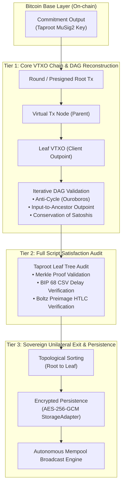
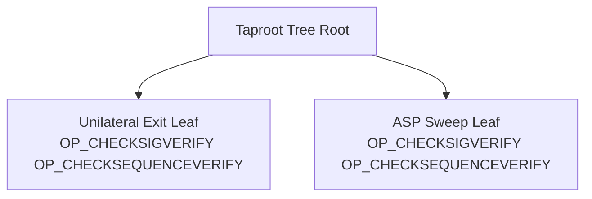

# Arkade Client Verification: Cryptographic & System Architecture

## 1. Executive Summary
The **Arkade Client Verification Pipeline** implements a zero-trust verification engine designed to operate within light clients, mobile apps, and self-custodial wallets. It allows a client receiving off-chain Virtual UTXOs (VTXOs) to mathematically verify that:
1. Every state transition from the on-chain anchor (Commitment Transaction) down to the leaf VTXO is cryptographically valid.
2. The Ark Service Provider (ASP) cannot retroactively confiscate funds or prematurely sweep assets.
3. The client possesses the complete topological transaction sequence and legal signatures needed to perform a **Sovereign Unilateral Exit** directly on the Bitcoin base layer without ASP cooperation.

---

## 2. Protocol Layers & Verification Tiers

---

## 3. Tier 1: DAG Reconstruction & Structural Integrity

### 3.1 Iterative Traversal vs Recursion
Traditional recursive DAG traversals fail when auditing large batches or multi-hop payment chains (e.g., deep tree structures exceeding JavaScript stack limits of ~10,000 frames). The engine utilizes an **explicit stack-based iterative traversal**:
- **Cycle Detection (Ouroboros Attack)**: Tracks visited `txid:vout` pairs in a hash set. If any node references an ancestor, verification immediately fails with `CYCLE_DETECTED`.
- **Economic Inflation Check**: Evaluates that $\sum \text{outputs} \le \sum \text{inputs}$ at every virtual node. If an ASP injects inflationary outputs, the node is rejected with `AMOUNT_MISMATCH`.
- **Orphan Payload Mitigation**: Virtual transactions must have an unbroken path of inputs connecting directly to a confirmed on-chain commitment output (`INPUT_CHAIN_BREAK`).

### 3.2 Schnorr & MuSig2 Key Aggregation
- **BIP 340**: Every internal virtual transaction uses Schnorr signatures over `SIGHASH_DEFAULT` (or specified sighash flags).
- **BIP 341**: Taproot public keys are aggregated using MuSig2 cosigner lists and tweaked against the script tree root $h_{\text{tree}}$:
  $$Q = P + \text{hash}_{\text{TapTweak}}(P \parallel h_{\text{tree}}) G$$
- The verification pipeline validates that the aggregated cosigner key matches the spent output's scriptPubKey.

---

## 4. Tier 2: Script Leaf & Timelock Satisfaction

### 4.1 Taproot Script Tree Verification
Every VTXO Taproot output commits to two primary spending paths:
1. **Collaborative Path (Key Path)**: ASP + User 2-of-2 MuSig2 signature (instant off-chain transfer).
2. **Unilateral Exit Path (Script Path)**: User signature after a relative timelock delay ($\Delta_{\text{CSV}}$).

### 4.2 Relative Timelock (BIP 68 / CSV) Enforcement
The client verifies that the relative sequence delay on the Unilateral Exit branch is strictly less than the round expiry sweep delay:
$$\Delta_{\text{exit}} < \Delta_{\text{sweep}}$$
This ensures that the user has guaranteed time to broadcast their exit transactions before the ASP can reclaim the output.

### 4.3 Submarine & Atomic Swaps (Boltz Integration)
For HTLC-encumbered VTXOs:
- **Claim Leaf**: Requires knowledge of preimage $R$ where $\text{HASH160}(R) = H$ or $\text{SHA256}(R) = H$, plus the user signature.
- **Refund Leaf**: Fallback to user after expiration.
- The pipeline parses the leaf script, computes the cryptographic digest, and ensures that the lock conditions cannot be front-run by the ASP.

---

## 5. Tier 3: Sovereign Unilateral Exit & Persistence

### 5.1 Topological Ordering & Broadcast Sequencing
When the ASP becomes unresponsive or acts maliciously:
1. The client loads the cached presigned DAG from local storage.
2. Orders all transactions from topological ancestor (Commitment Tx Child) down to the user's Leaf VTXO.
3. Broadcasts transactions sequentially to the Bitcoin P2P network (or via public Esplora / Electrum RPCs), honoring the required confirmation and CSV delays between stages.

### 5.2 Forensic Security & Storage Hardening
- Exit metadata contains presigned transactions, private cosigner nonces, and topological dependency maps.
- All stored state at rest is encrypted using **AES-256-GCM** with authenticated payloads.
- If storage corruption is detected, the pipeline fails safely without executing corrupted broadcasts.
