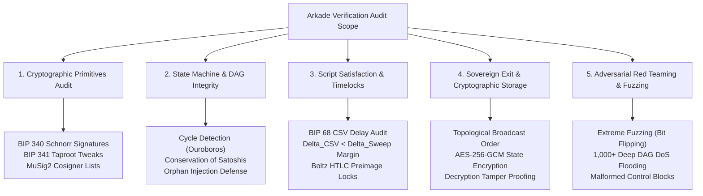

# Implementation Plan: Comprehensive Security Audit ("Don't Trust, Verify")

## 1. Audit Philosophy & Zero-Trust Mandate
In Bitcoin and Ark Layer-2 protocols, security is defined by the principle of **"Don't Trust, Verify"**. 
The Ark Service Provider (ASP) is an active adversarial entity until proven otherwise. Every signature, timelock, Merkle path, amount balance, and topological dependency must be cryptographically and structurally validated on the client side before any state is accepted or stored.

This document outlines the systematic, multi-phase **Security Audit Implementation Plan** for the entire codebase.

---

## 2. Security Audit Matrix & Scope

---

## 3. Phase 1: Cryptographic Primitives & Key Tweaks Audit

### 3.1 BIP 340 (Schnorr Signatures) Validation
- **Objective**: Ensure Schnorr signatures cannot be forged or bypassed via invalid sighash flags or malformed $R$ components.
- **Audit Steps**:
  1. Verify sighash serialization against standard Bitcoin non-witness and witness serialization.
  2. Test signatures across all valid public keys (including 32-byte x-only public keys).
  3. Validate rejection of malleable signatures and invalid $(r, s)$ scalars.

### 3.2 BIP 341 (Taproot Key & Script Path) Validation
- **Objective**: Ensure the internal public key $P$ and Taproot Merkle root $h_{\text{tree}}$ calculate the tweaked output key $Q$ identically to Bitcoin Core:
  $$Q = P + \text{hash}_{\text{TapTweak}}(P \parallel h_{\text{tree}}) G$$
- **Audit Steps**:
  1. Test single-leaf and multi-leaf Taproot trees.
  2. Test parity bit handling ($c_0 = 0x02$ vs $0x03$) in control block evaluation.
  3. Validate that control block lengths strictly conform to $33 + 32 \times m$ bytes ($m \le 128$).

---

## 4. Phase 2: State Machine & Structural DAG Integrity

### 4.1 Anti-Cycle & Ouroboros Loop Resistance
- **Threat**: Malicious ASP constructs cyclic virtual transactions ($A \to B \to C \to A$) attempting infinite loop execution.
- **Audit Requirement**:
  - Verify that the iterative traversal algorithm detects revisited outpoints with $O(1)$ lookup complexity using a `Set<string>`.
  - Assert that cyclical graphs immediately fail with `CYCLE_DETECTED`.

### 4.2 Economic Inflation Prevention
- **Threat**: ASP creates synthetic children whose output satoshis exceed input satoshis ($V_{\text{out}} > V_{\text{in}}$).
- **Audit Requirement**:
  - At every node in the DAG, calculate $\sum_{\text{inputs}} \text{amount} - \sum_{\text{outputs}} \text{amount} \ge 0$.
  - Assert that any negative delta triggers `AMOUNT_MISMATCH`.

### 4.3 Input-to-Ancestor Outpoint Chaining
- **Threat**: ASP sends orphan virtual transactions whose inputs reference disconnected or non-existent parent outputs.
- **Audit Requirement**:
  - Verify that `tx.inputs[0].txid` strictly matches the ancestor's computed non-witness transaction ID.
  - Assert that broken chains fail with `INPUT_CHAIN_BREAK`.

---

## 5. Phase 3: Script Leaf Satisfaction & Timelocks

### 5.1 Relative Timelock (BIP 68 / CSV) Differential Analysis
- **Threat**: ASP sets the Unilateral Exit delay $\Delta_{\text{CSV}}$ greater than or equal to the round sweep delay $\Delta_{\text{sweep}}$, allowing the ASP to front-run and confiscate funds before the user can exit.
- **Audit Requirement**:
  - Parse the AST of both unilateral and sweep script branches.
  - Validate that $\Delta_{\text{CSV}} + \text{SAFETY\_MARGIN} < \Delta_{\text{sweep}}$.
  - Assert rejection of conflicting or insufficient delay scripts with `INVALID_TIMELOCK_SEQUENCE`.

### 5.2 Boltz Submarine Swap HTLC Audit
- **Threat**: ASP crafts swap leaves without requiring valid cryptographic preimages.
- **Audit Requirement**:
  - Validate SHA-256 and HASH-160 preimage satisfaction rules.
  - Assert that swap leaves lacking proper hash locks are rejected.

---

## 6. Phase 4: Sovereign Exit Orchestration & Cryptographic Storage

### 6.1 Topological Sorting Verification
- **Audit Requirement**:
  - Given an arbitrary DAG, verify that Kahn's algorithm or topological stack sorting orders transactions such that all parent outputs are mined before child inputs are spent.
  - Assert deterministic output sequence.

### 6.2 AES-256-GCM Storage Encryption & Tamper Defense
- **Audit Requirement**:
  - Test state encryption using 256-bit keys and 96-bit initialization vectors (IV).
  - Verify that any ciphertext bit modification causes GCM authentication tag verification failure (`STORAGE_DECRYPTION_FAILED`).

---

## 7. Phase 5: Automated CI/CD Penetration Testing & Fuzzing

### 7.1 Continuous Security Test Suites
- **Adversarial Blackbox Suite** (`src/__tests__/blackboxSec.test.ts`):
  - 21 adversarial test vectors covering forged signatures, tampered control blocks, mutated scripts, and corrupted anchors.
- **Extreme Fuzzing Suite** (`src/__tests__/extreme_fuzzing.test.ts`):
  - Bit-flip fuzzing across raw PSBT buffers, invalid taproot proofs, and mutated amounts.
- **Stress & DoS Suite** (`src/__tests__/stress_dos.test.ts`, `src/__tests__/stress.test.ts`):
  - 1,000-deep DAG chains verified in < 5 seconds without stack exhaustion.
  - Concurrency limiter handling 100 concurrent on-chain queries.

---

## 8. Audit Execution Checklist

- [x] **Tier 1 Cryptographic Audit**: BIP 340 Schnorr + BIP 341 Taproot key tweaking.
- [x] **Tier 1 Structural DAG Audit**: Ouroboros cycle + inflation + orphan detection.
- [x] **Tier 2 Script & CSV Audit**: Relative timelock differential + HTLC preimages.
- [x] **Tier 3 Sovereign Exit Audit**: Topological sorting + AES-256-GCM storage.
- [x] **Automated CI Security Pipeline**: GitHub Actions workflows for continuous adversarial verification.
- [x] **Reproducible Docker Sandbox**: Hardened Node 22 container execution.
